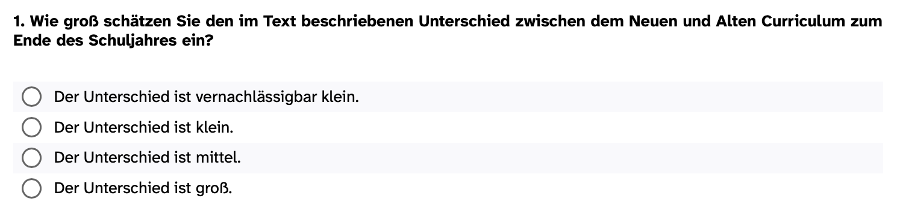
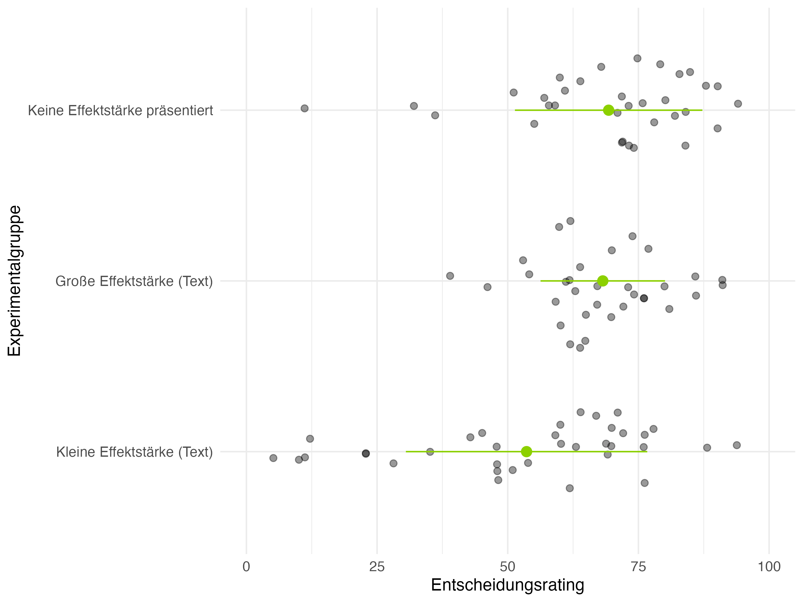
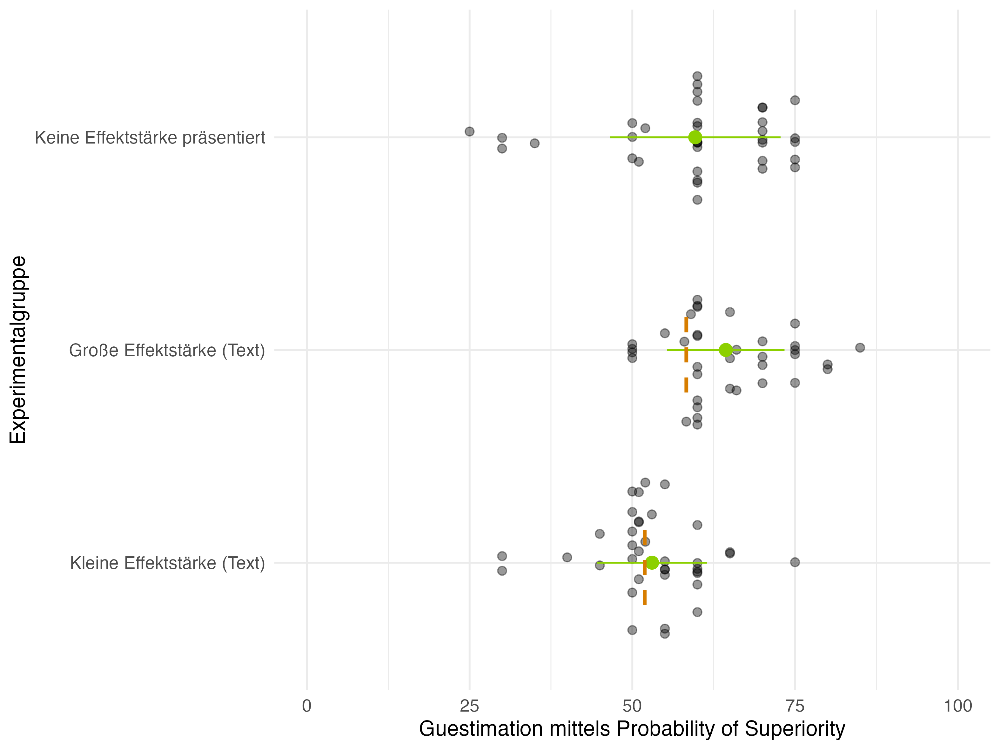
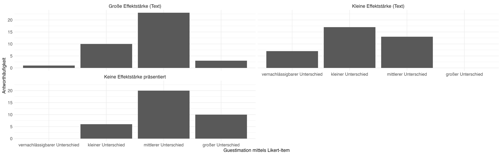
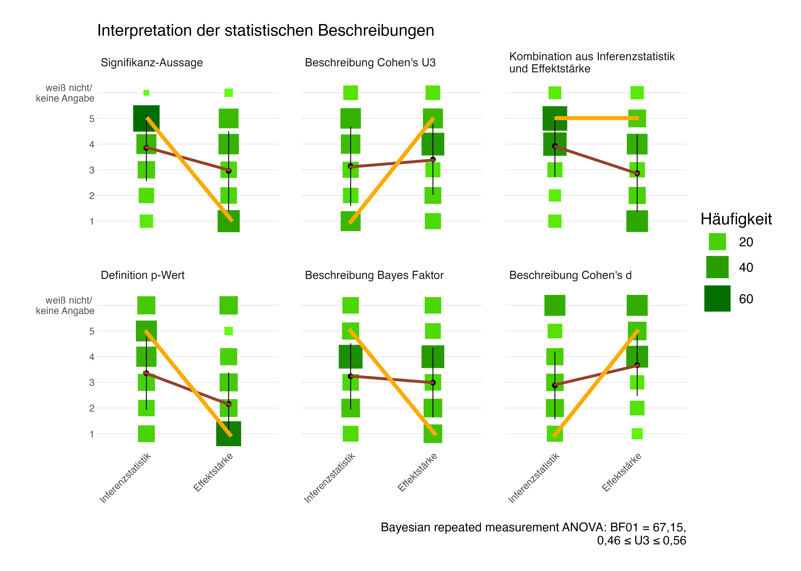
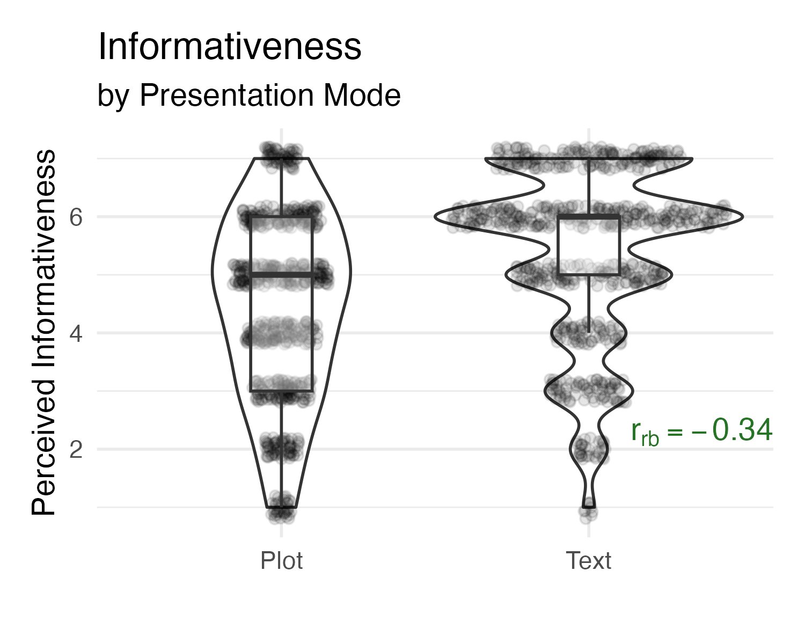
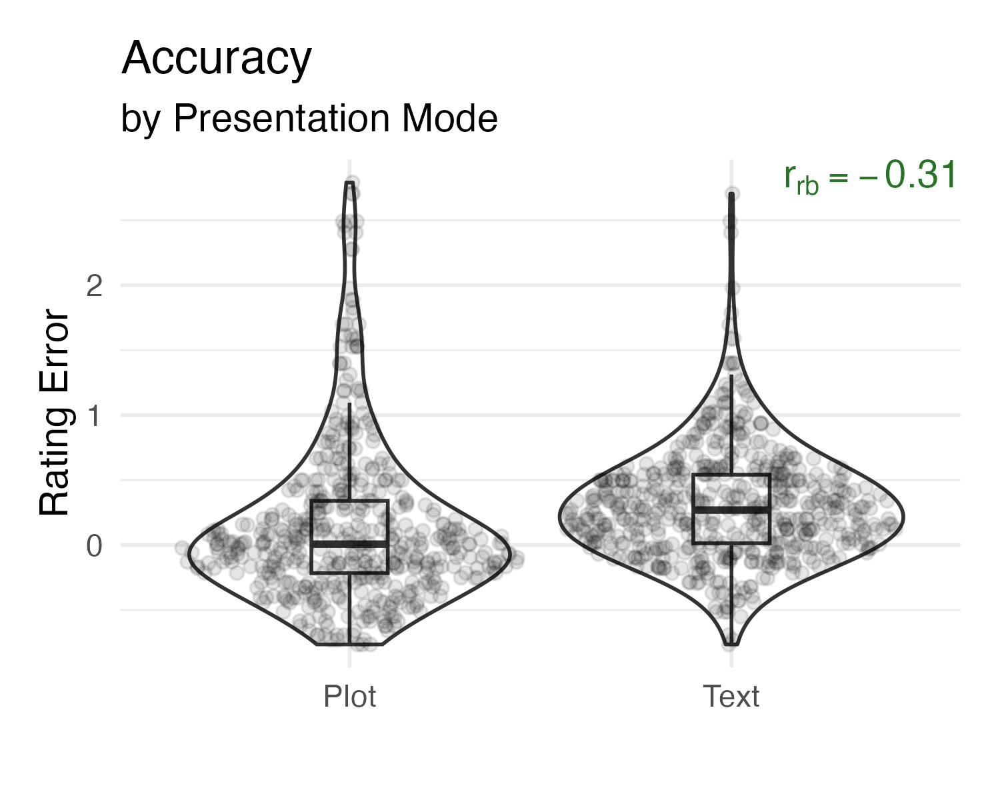

## Überblick  {.smaller .center}

```{r }
#| label: libraries
#| echo: false

# z.B. library(tidyverse)
```

- Wissenschaftskommunikation
- Experimentelle Studie: Practical Significance Bias?
  + 
- Ausblick: Weitere Befunde zur Effektstärken-<br>kommunikation
- Referenzen


::: notes

- eher neuere Studien ausgewählt, die aber teilweise noch in der Erhebung sind 
- klassischer Aufbau, wobei ich mich eher für einen Ausblick am Ende statt einer übergreifenden Diskussion - dann gemeinsam

:::


## Kommunikation von Forschungsergebnissen  {.smaller .scrollable}

- Diverse Formate der Wissenschaftskommunikation [@besa2024]
  + Kaum empirische Forschung zu nutzer:innenfreundliche Gestaltung von Wissenschaftskommunikation [z.B. @fitzgerald2022; @lortie2021; @merk2023]
  + Diverse Darstellungsweisen der Forschungsergebnisse: 

<center> 
| | | | |
|--|--|--|--|
|{.lightbox width="160" fig-align="left"}[@knogler2017]|{.lightbox width="160" fig-align="left"}[@backfisch2021]|{.lightbox width="160" fig-align="left"}[@rijkhoek2019]|{.lightbox width="160" fig-align="left"}[@michler2014]|
</center>

- Verschiedene textliche und visuelle Darstellungen von Effektstärken beeinflussen die Wahrnehmung und Einschätzung von Effektstärken durch (angehende) Lehrpersonen [z.B. @schmidt2023; @merk2023; @kuhlwein2025; @schneider2024]
- Wenn in Forschungsberichten Informationen über Effektstärken fehlen, assoziieren wissenschaftliche Laien automatisch große Effekte (Practical Significance Bias) [@michal2024]

<!-- {.lightbox width="160" fig-align="left"}[@adesope2017]|{.lightbox width="100"}| -->

::: notes
- Hintergrund ist der
- Wenn man sich aktuell die Landschaft der Wissenschaftskommunikation anschaut sehr divers
  + von Pressemitteilungen, Zeitungsartikel über Podcasts bis hin zu knowledge broker wie CH
  + allerdings kaum empirische Forschung, die untersucht Forschungsergebnisse für die Zielgruppe der Lehrpersonen informativ, praktisch relevant aber dennoch verständlich aufbereitet werden kann
  + spiegelt sich auch in ganz unterschiedliche Ansätze wider
    - Clearinghouses: Effektstärken berichtet z.B. Cohen's d als numerischer Wert, andere eine Transformation von Cohen's d, sogenannte Cohen's U3 (erklären) - verbal, aber auch visuel
    - In Pressemitteilungen oder Abstracts aus Originalstudien  gar keine Information über Effektstärke z.B.  nur die Rede von "Schüler:innen in der vorderen Sitzreihe lösen Matheaufgaben schneller als in der hinteren Sitzteihe" 
    - Zeitungsartikel: Effektgröße im Sinne von Mittelwertsunterschieden, aber ohne Information über Streuung, also keine sogenannten standardisierten Effekt
  + Die wenige Forschung, die existiert zeigt, dass unterschiedliche Darstellung unterschiedlich wahrgenommen und eingeschätzt werden 
  + hervorheben mnöchte ich vor allem ein Ergebnis nämlich, dass eine neuere Studie zeigt, dass fehlende Information von Effektstärken dazu führt, dass automatisch ein großer Effekt assoziiert wird - sogenannten practical significance bias; Studie erweitert replizieren

::: 

## Forschungsfrage 
<br>
<br>
<center>
Inwieweit weisen Lehramtsstudierende beim Rezipieren von Evidenz einen Practical Significance Bias auf?
</center>


::: notes

- um herauszufinden, inwieweit auch Lehramtsstudierende einem PSB unterliegen
- Erweiterung der Replikation vernachlässige ich heute


:::

## Stichprobe 

- *N* = 211 Lehramtsstudierende
- 68,25 % der Studierende sind weiblich und studieren im zweiten Semester
- 53,55 % der Studierende studieren Lehramt der Primarstufe
- 46,92 % der Studierende studieren mindestens ein Fach im sprachlichen Bereich


::: notes

erneut Lehramtsstudierende mit unterschiedlichen (akademischen) Hintergründen; insgesamt 211

:::

## Design, Materialien und Variablen  {.smaller .scrollable}

- Between-person Experiment mit fünf Experimentalbedingungen (1 = Effektstärke wird nicht präsentiert; 2 = kleine Effektstärke als Text; 3 = große Effektstärke als Text; [4 = kleine Effektstärke als BESD; 5 = große Effektstärke als BESD]{style="color:lightgrey;"})

<center>{.lightbox group="my-gallery" width="300"}</center>

::: {style="display:none"}
{.lightbox group="my-gallery" width="300"} :::

- Abhängige Variablen:
  - *Entscheidungsrating*: <br> {.lightbox width="400"}
  - *Guestimation der Effektstärke:*

|  |  |
|-----------------------------------:|:-----------------------------------|
| Probability of Superiority {.lightbox width="500"} | Likert-Item {.lightbox width="400"} |


::: notes

- wieder between-person design
- insgesamt 5, aber nur 3 Experimentalbedingungen für heute relevant
- Alle Studierenden erhielten einen solchen Ausschnitt zur Mathekompetenz bei Grundschulkindern. Forscher:innen das alte Curriculum mit einem neuen Vergleichen 
  + dieser Bericht unterscheided sich zufällig darin, wie die Ergebnisse dargestellt werden
    + wie hier keine Effektstärke
    + kleine Effektstärke verbal (wie im Orignal) 
    + große Effekte statt 27, 35%
    + Erweiterung jetzt nicht relevant
- Studierenden sollten dann ein Entscheidungsrating abgeben, auf einer Skala von 0 bis 100 inwieweit sie dem Schulbezirk empfehlen würden das neue Curriculum einzusetzen
- ergänzend zur Originalstudie noch die Einschätzung der Effektstärke abgefragt
  + angelehnt an die sogenannte POS, indem sie angeben sollten wie wahrscheinlich es ist, dass ein zufällig ausgewählte Schülerin, die die Regelstandard erreicht hat, mit dem neuen Curriculum unterrichtet wurde
  + ordinalen Skala
- zusätzlich Ihre Entscheidung begründen (noch nicht ausgewertet)


Kommen wir auch hier - zu den vorläufigen - Ergebnissen
:::


## Ergebnisse: Entscheidungsrating 

<center>{.lightbox width="700"}</center>


::: notes

- rein deskriptiv

- Schauen wir uns zunächst das Entscheidungsrating an, also inwieweit sie das neue Curriculum empfehlen würden
  + x-Achse Rating
  - y-Achse verschiedenen Experimentalgruppen
- fokussieren wir die keine Effektstärke und große Effektstärke-Bedingung, sehen wir kaum Unterschiede im Antwortverhalten, d.h. ähnlich stark empfehlen -> könnte man also deskriptiv als PSB deuten
- wir sehen aber auch, dass die Studierenden zwischen kleiner und großer Effektstärke differenzieren, dass sie das Curriculum im Durchschnitt stärker empfehlen, wenn größere Effektstärke präsentiert wird

::: 


## Ergebnisse: Guestimation I 

<center>{.lightbox width="700"}</center>

::: notes

- hinsichtlich der Einschätzung der Effektstärke, deskriptiv weniger unterschiedlich könnte man sagen
- Einschätzungen sind ohne Angaben zur Effektstärke etwas geringer als bei Bedingung große Effektstärke (Text), aber durchschnittlich größer als bei Bedingung kleiner Effekt.


Ergänzende Note:

- mit BESD akkurater, aber auch mehr, die die Richtung verwechseln
::: 

## Ergebnisse: Guestimation II 

<center>{.lightbox}</center>


::: notes

- weitere Operationalisierung: Ergebnisse des Likert Items / oridinal
- auch hier erkennen wir, dass die Antwortverteilung zwischen groß und keine Effektstärke sehr ähnlich ist, bei keine Effektstärke sogar häufiger großer Effekt angekreuzt wird
- wir erkennen aber auch, dass zwischen groß und kleiner Effektstärke differenziert wird


::: 

## Zentrale (vorläufige) Erkenntnisse 
* Practical Significance Bias kann bei Lehramtsstudierenden repliziert werden [@michal2024]
  + Je nach Operationalisierung (Entscheidungsrating vs. Guestimation) unterschiedlich stark ausgeprägt
  + Kommunizieren von Effektstärken als mögliche Gegenmaßnahme 

::: notes
- zusammengefasst deuten die ersten deskriptiven Analysen also darauf hin, dass sich der PSB bei Lehramtsstudierenden replizieren lässt, aber je nach Operationalisierung/Stimuli unterschiedlich stark ausgeprägt ist (Idee thinking fast/slow)
- gleichzeitig auch Gegenmaßnahme deutlich: Kommunizieren von Effektstärke
  + Titel Ergebnisse aus verschiedenen experimentellen Studien angekündigt, daher noch Überblick weitere Forschungsbefunde aus unserer AG


::: 

## Ausblick: Weitere Befunde zur Effektstärkenkommunikation  {.smaller .scrollable}

- Lehrpersonen differenzieren zwischen kleinen und großen Effektstärken [@merk2023; @kuhlwein2025]
- Mit geeigneten Visualisierungen schätzen Lehrpersonen Effektgrößen erstaunlich akkurat ein (Darstellung von Streuung [@merk2023]; Annotationen [@schneider2024]) 

<center> {.lightbox group="my-gallery" width="100"} </center>

- ***Common** Language Effect Size* $\nRightarrow$ ***Widely Understood** Effect Size*: 
  + Lehrpersonen weisen Fehlkonzepte z.B. in der Interpretation von Cohens' U3 auf  [z.B. @kuhlwein2025; @schmidt2023; @schneider2024]
  + Lehrpersonen haben (teilweise) Schwierigkeiten Informationen über Effektstärken und Inferenzstatistiken voneinander zu trennen [z.B. @schmidt2023] 
<center> {.lightbox width="150"} </center>

- __Text und Bild scheinen komplementäre Vor- und Nachteile zu haben__: Lehrpersonen nehmen Cohen's U3-Formulierungen beispielsweise informativer wahr, schätzen aber visuelle Effektstärkendarstellung (Halfeye-Plots) genauer ein [@kuhlwein2025]

|||
|--|--|
|{.lightbox width="100"}|{.lightbox width="100"}|


::: notes 
- Lehrpersonen können zwischen großen und kleinen Effekten unterscheiden -> wie auch vorher und daher verstärktes Argument für EffSize
- gerade mit geeigneten Visualisierungen z.B. neben Infos zur MW auch Streuung oder zusätzliche Annotationen gelingt es ihnen auch Effektsize erstaunlich akkurat einzuschätzen
  + neue Studie deutet darauf hin, dass BESD ein Ansatz sein könnte, hier Einschätzungen bei POS ziemlich akkurat

- In Literatur spricht man von common language effect sizes / translated effect sizes, um Effektgröße leichter verständlich aufzubereiten, aber bedeutet nicht gleich weit verständliche Effektstärke, 
  + z.B. viele Fehlkonzepte bei U3
  + trotzdem Schwierigkeiten zwischen Effsize und U3 zu unterscheiden (Anmerkung Disentangling -> Paralellität zu PSB)
  + was dazu führt, dass wirklich visuelle Ergänzungen hilfreich sein könnten

- ABER Visualisierungen und Text scheinen komplementäre Vor-und Nachteile zu haben: Viz akkuratere Einschätzungen, aber Text informativer, leichter verständlich (etwas informativer -> relevanter für die Praxis)


Zusatz:
- Overlap etwas weniger Bias, aber immer noch gebiased
::: 

## Limitation 

> Interpretation eine notwendige, aber nicht hinreichende Bedingung für gelingendes evidenzinformiertes Handeln 


<center>

_adapted_barriers_black.png){.lightbox width="400"} <br>

Eigene Adaption des Prozessmodells nach @grossophoff2023

</center>

::: notes
- möchte nochmals herauszoomen
- deutlich gemacht, dass trotz der Vorarbeiten es noch viel zu tun gibt
- die Interpretation von statistischen Informationen zwar notwendig, aber nicht hinreichend für gelingedes evidenzinformiertes Handeln
    + sie ist nur ein Faktor, der z.B. neben Überzeugungen, die Schlussfolgerung beeinflusst
    + und insgesamt ist die Schlussfolgerungsphase wiederum nur ein kleines Puzzleteil eines komplexen Prozesses
    + gerade auch der Bezug zur Nutzung muss stärker hergestellt werden

:::


## Referenzen
