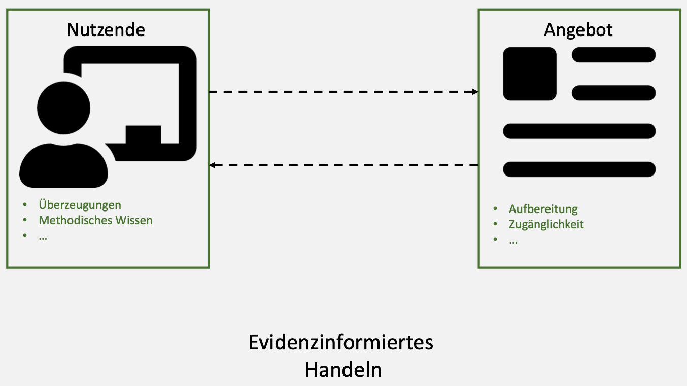
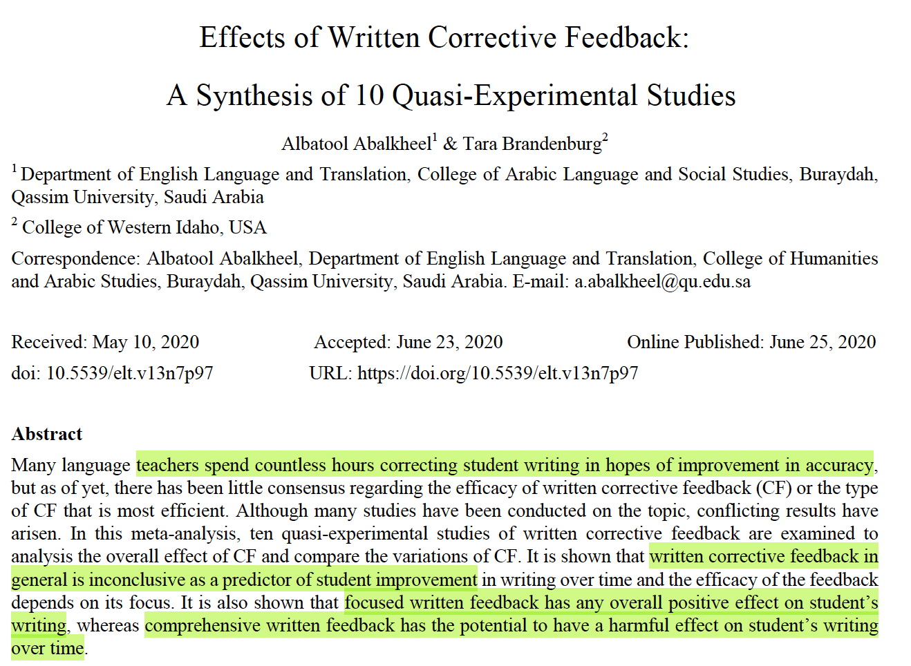
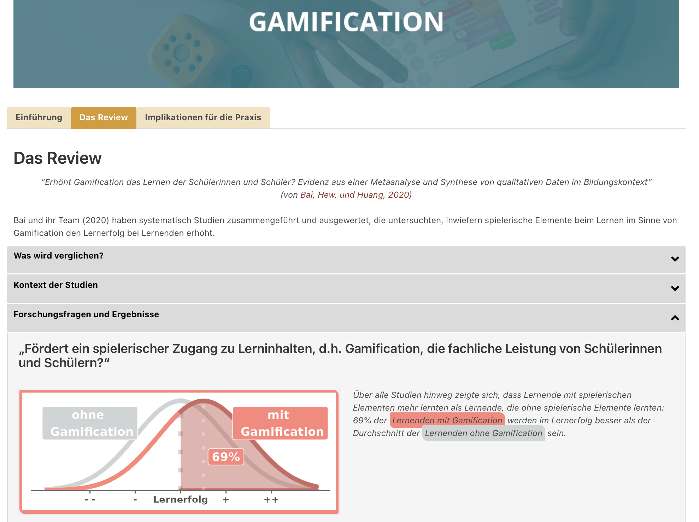
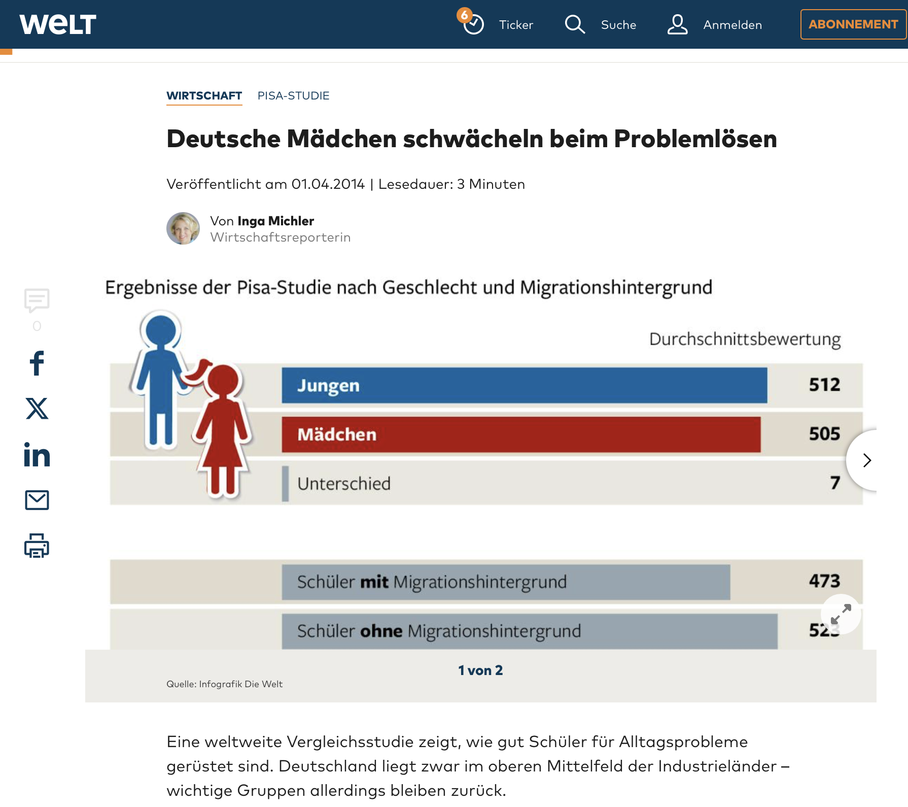
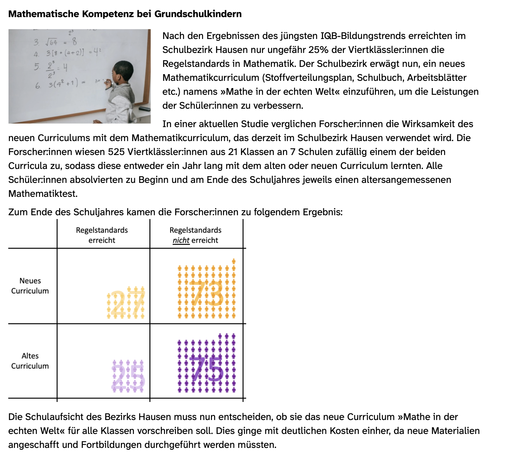
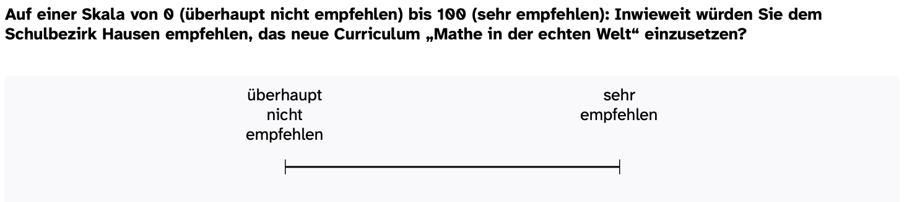
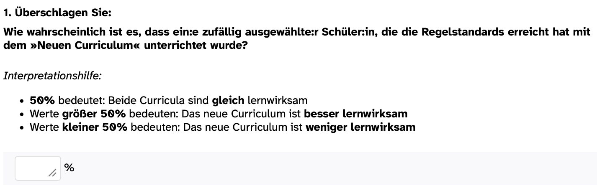
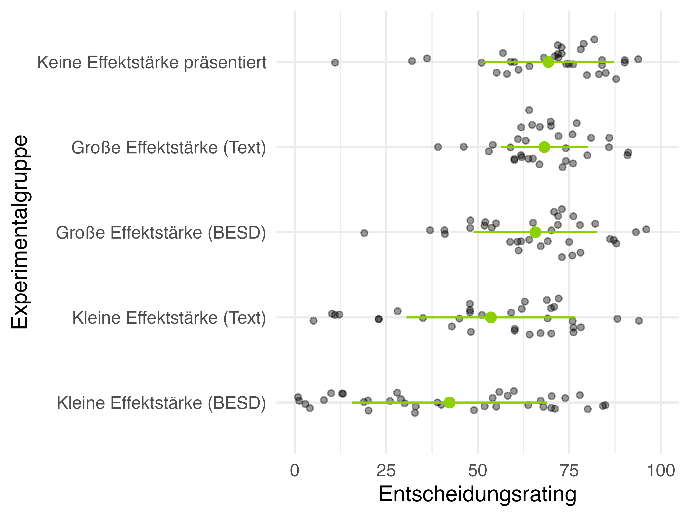
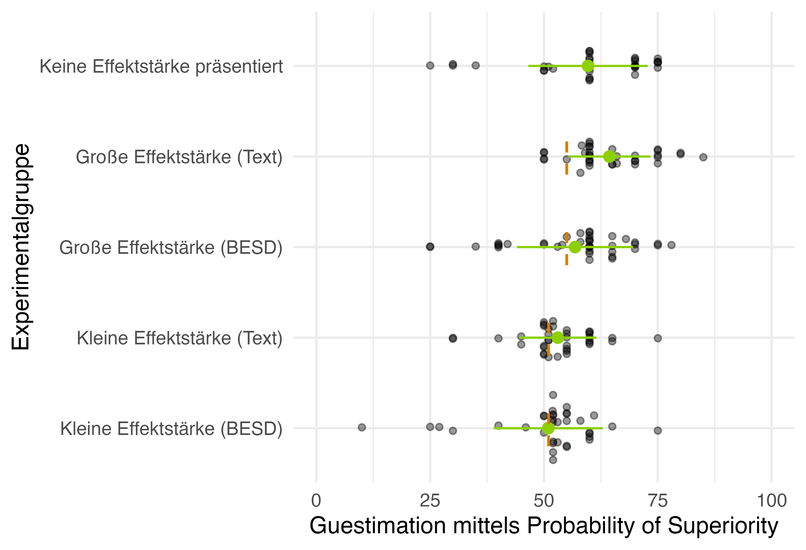
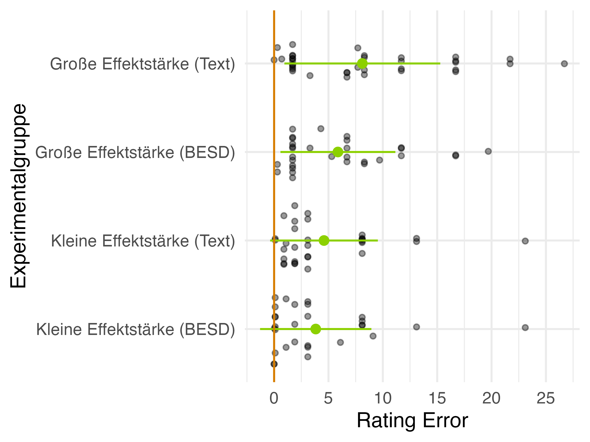

## Überblick  {.smaller .center}

```{r }
#| label: libraries
#| echo: false

# z.B. library(tidyverse)
```

- Evidenzinformierte Schulpraxis 
- Wissenschaftskommunikation 
- Experimentelle Studie: Practical Significance Bias?
  + Forschungsfrage 
  + Stichprobe 
  + Design, Materialien und Variablen  
  + Ergebnisse 
- Diskussion 
- Referenzen 


::: notes

:::


## Evidenzinformierte Schulpraxis  {.smaller auto-animate="true"}

> Faktoren, die evidenzinformiertes Handeln fördern oder hemmen, sind divers [vgl. z.B. systematische Reviews von @dagenais2012; @hemsley-brown2003; @schmidt2024; @schaik2018], können aber in Faktoren seitens  __der Nutzenden__ oder __des Angebots__ unterteilt werden [@schmidt2024]

<center>
{.lightbox width="50%" fig-align="center"}

</center>

::: notes

- Heuristik für zahlreiche Forschungsansätze rund um evidenzinformierte Schulpraxis
- Nutzendenseite bezieht sich auf die Ausstattung der (angehenden) Lehrpersonen - evidenzinformiertes Handeln erleichtern
- Angebot bezieht sich auf die wissenschaftliche Evidenz
  - Aufbereitung durch Forschende oder Schnittstellen sogenannte Knowledge Brokers wie Clearing Houses

- Zudem können sich beide Seiten gegenseitig beeinflussen
  + Umsetzung EISP auch als Interaktion zwischen Angebot und Nutzung verstehen
  + Beispiel: Graph literacy könnte durch ein gut gemachtes Angebot z.B. Visualisierungen mit Hervorhebungen, die die Aufmerksamkeit auf wichtige Infos lenken, erhöht werden

  
- Vorträge im Symposium Nutzendenseite zuzuordnen
  + Rechercheverhalten
  + Nützlichkeitseinschätzungen
  + Argumentationsfähigkeit
_ Unser Vortrag Angebotsseite
  + Aufbereitung der Evidenz -> Wissenschaftskommunikation
  
:::


## Wissenschaftskommunikation  {.smaller}

- Diverse Formate der Wissenschaftskommunikation [@besa2024], aber kaum empirische Forschung zur nutzer:innenfreundlichen Gestaltung von Wissenschaftskommunikation [z.B. @fitzgerald2022; @lortie2021; @merk2023]
- Effektexistenz und Effektstärke zentrale Information von Wissenschaftskommunikation, um praktische Schlussfolgerungen ziehen zu können


:::{.fragment}
<center> {.lightbox width="75%" fig-align="center"} </center>
:::

::: notes

- Fehlkonzepte zu bildungswissenschaftlichen Themen sind prävalent unter Praktiker:innen
- Wissenschaftskommunikation notwendig, um Fehlkonzepte zu reduzieren / aufzulösen
- Dafür Kommunikation über Effektexistenz notwendig
  + z.B. hat das Unterrichten gemäß der Lernstile einen Effekt auf Schüler:innenleistung -> keine Effektexistenz -> Konsequenz es nicht umzusetzen liegt nahe, sonst hohe Opportunitätskosten -> viel Zeit in eine Methode investiert, die nachweislich Lernleistung nicht steigert; Zeit könnte für effektive Methode eingesetzt werden
  + weiteres Beispiel: umfassendes - korrektives - schriftliches Feedback, hier im Gegensatz zu Lernstile Effektexistenz (teilweise) vorhanden, aber gleich sinnvoll umzusetzen?
  + in diesem Fall benötigen wir zusätzlich Info über Größe d. Effekts
  + L. investiert vermutlich mehrere Stunden pro Woche in ausführliches schriftliches Feedback, wenn jetzt - wie die Evidenz zeigt - der Effekt aber gering ist -> hohe Opportunitätskosten
  + L. könnte diese Zeit anderweitig nutzen, fokussiertes Feedback

:::


## Wissenschaftskommunikation  {.smaller .scrollable}

> Unterschiedliche Darstellungen von Effektstärken in Wissenschaftskommunikation vorhanden:

<center>
| | | | |
|--|--|--|--|
|{.lightbox width="140" fig-align="left"}<br>[@knogler2017]|{.lightbox width="140" fig-align="left"}<br>[@backfisch2021]|{.lightbox width="140" fig-align="left"}<br>[@rijkhoek2019]|{.lightbox width="140" fig-align="left"}<br>[@michler2014]|
</center>

  * Lehrpersonen können zwischen kleinen und großen Effektstärken differenzieren [@merk2023; @kuhlwein2025]
  * ***Common** Language Effect Size* $\nRightarrow$ ***Widely Understood** Effect Size*: Lehrpersonen weisen Fehlkonzepte z.B. in der Interpretation von Cohens' U3 auf  [z.B. @kuhlwein2025; @schmidt2023; @schneider2024]
  * Mit geeigneten Visualisierungen schätzen Lehrpersonen Effektgrößen erstaunlich akkurat ein (Darstellung von Streuung [@merk2023]; Annotationen [@schneider2024])
  * Wenn in Forschungsberichten Informationen über Effektstärken fehlen, assoziieren wissenschaftliche Laien automatisch große Effekte [Practical Significance Bias, @michal2024]


::: notes
- Landschaft der Wissenschaftskommunikation sehr divers
  + von Pressemitteilungen, Zeitungsartikel über Podcasts bis hin zu knowledge broker wie Clearing Houses
  + allerdings kaum empirische Forschung, die untersucht wie Forschungsergebnisse informativ, praktisch relevant Zielgruppe aber dennoch verständlich für Lehrpersonen aufbereitet werden kann
  + spiegelt sich auch in ganz unterschiedlichen Ansätzen wider
    - Clearing Houses: Effektstärken z.B. Cohen's d als numerischer Wert, andere eine Transformation von Cohen's d, sogenannte Cohen's U3 (erklären) - verbal, aber auch visuel
    - In Pressemitteilungen keine Information über Effektstärke z.B.  nur die Rede von "Schüler:innen in der vorderen Sitzreihe lösen Matheaufgaben schneller als in der hinteren Sitzteihe"
    - Zeitungsartikel: Effektgröße im Sinne von Mittelwertsunterschieden, aber ohne Information über Streuung, also keine sogenannten standardisierten Effekte
  + Die wenige Forschung, die existiert zeigt, dass unterschiedliche Darstellungen unterschiedlich wahrgenommen und eingeschätzt werden -> Texte häufig Fehlkonzepte, obwohl aus theoretischer Perspektive "leicht verständlich", geeignete visuelle Darstellung -> erstaunlich akkurate Einschätzungen
  + neuere Studie zeigt, dass fehlende Information über Effektstärken dazu führt, dass automatisch ein großer Effekt assoziiert wird - sogenannter practical significance bias
 
- Hier mit unserer Studie ansetzen 


:::

# Experimentelle Studie: Practical Significance Bias?


::: notes

- Practical Significance Bias mit Lehramtsstudierenden replizieren
- zusätzlich um ein weiteres Kommunikationsformat - sog. Binomial Effect Size Displays - anreichern

:::


## Forschungsfragen 

**Forschungsfrage 1:** Inwieweit weisen Lehramtsstudierende beim Rezipieren von Evidenz einen Practical Significance Bias auf?

<br>

**Forschungsfrage 2:** Inwieweit reduzieren sogenannte Binomial Effect Size Displays (BESD) verzerrte Einschätzungen von Effektstärken?


::: notes

- um herauszufinden, inwieweit auch Lehramtsstudierende einem PSB unterliegen
- Darstellung von Effektstäkren in Form von BESD verzerrte Einschätzungen reduzieren

:::

## Stichprobe 

- *N* = 211 Lehramtsstudierende
- 68,25 % der Studierenden sind weiblich und studieren im zweiten Semester
- 53,55 % der Studierenden studieren Lehramt der Primarstufe
- 46,92 % der Studierenden studieren mindestens ein Fach im sprachlichen Bereich


::: notes

- 211 Lehramtsstudierende mit unterschiedlichen (akademischen) Hintergründen
:::


## Design, Materialien und Variablen  {.smaller .scrollable}

- Between-person Experiment mit fünf Experimentalbedingungen (1 = Effektstärke wird nicht präsentiert; 2 = kleine Effektstärke als Text; 3 = große Effektstärke als Text; 4 = kleine Effektstärke als BESD; 5 = große Effektstärke als BESD)

<center>{.lightbox group="my-gallery" width="300"}</center>

::: {style="display:none"}
{.lightbox group="my-gallery" width="300"}

{.lightbox group="my-gallery" width="300"}

:::

- Abhängige Variablen:
  - *Entscheidungsrating*: <br> {.lightbox width="400"}
  - *Guestimation der Effektstärke:* <br> {.lightbox width="500"}


::: notes

- between-person design mit insgesamt 5 verschiedenen Experimentalbedingungen
- Alle Studierende erhielten einen Ausschnitt zur Mathekompetenz bei Grundschulkindern. Forscher:innen untersuchten die Effektivität des alten und neuen Curriculums
  + dieser Bericht unterschied sich zufällig darin, wie die Ergebnisse dargestellt wurden
    + wie hier keine Effektstärke (wie im Original, nur auf Deutsch übersetzt)
    + kleine Effektstärke als Text (wie im Original, nur auf Deutsch übersetzt)
    + große Effekte statt 35% vs. 25% (wie im Original, nur auf Deutsch übersetzt)
    + Erweiterung des Originals: Effektstärke als BESD dargestellt; BESD ausgewählt, da wir aus bisheriger Forschung wissen, dass geeignete Visualisierungen akkuratere Einschätzungen fördern und, dass Darstellungen von natürlichen Häufigkeiten Rezeption erleichtert
- Studierenden sollten ein Entscheidungsrating abgeben, auf einer Skala von 0 bis 100 inwieweit sie dem Schulbezirk empfehlen würden das neue Curriculum einzusetzen
- ergänzend zur Originalstudie noch die Einschätzung der Effektstärke abgefragt
  + angelehnt an die sogenannte POS, indem sie angeben sollten wie wahrscheinlich es ist, dass eine zufällig ausgewählte Schülerin, die die Regelstandards erreicht hat, mit dem neuen Curriculum unterrichtet wurde


Kommen wir auch zu den Ergebnissen
:::


## Hypothesen {.smaller .scrollable}

::: {style="font-size: 0.8em;"}
**Practical Significance Bias**

*Entscheidungsrating*

* H<sub>1a</sub>: keine Effektstärke > kleine Effektstärke (Text)
* H<sub>1b</sub>: keine Effektstärke ≅ große Effektstärke (Text)

*Guestimation*

* H<sub>1c</sub>: keine Effektstärke > kleine Effektstärke (Text)
* H<sub>1d</sub>: keine Effektstärke ≅ große Effektstärke (Text)

**Effektstärkenverständnis**

*Wahrgenommene Effektstärke*

* H<sub>2a</sub>: große Effektstärke (Text) > kleine Effektstärke (Text)
* H<sub>2b</sub>: große Effektstärke (BESD) > kleine Effektstärke (BESD)
* H<sub>2c</sub>: kleine Effektstärke (Text) > kleine Effektstärke (BESD)

*Rating Error der Effektstärkeneinschätzung *

* H<sub>3a</sub>: große Effektstärke (Text) > große Effektstärke (BESD)
* H<sub>3b</sub>: kleine Effektstärke (Text) > kleine Effektstärke (BESD)

:::


::: notes

- um herauszufinden wie stark die eingeschätzte Effektstärke von der tatsächlich präsentierten Effektstärke abweicht, haben wir den Rating error gebildet - also das Gegenteil zu Akkuratheit

::: 


## Ergebnisse: Entscheidungsrating 

<center>{.lightbox width="700"}</center>


::: notes

- Schauen wir uns zunächst das Entscheidungsrating an, also inwieweit die Studierenden das neue Curriculum empfehlen würden
  + x-Achse Rating
  - y-Achse verschiedenen Experimentalgruppen
- Hypothese, dass Empfehlung in Bedingung "keine Effektstärke präsentiert" sich im Schnitt kaum von der Empfehlung in der großen Effektstärke-Bedingung unterscheidet 
  + deskriptiv erkennbar
- weitere Hypothese, dass die Bedingung "keine Effektstärke präsentiert" sich von der kleinen-Effektstärken-Bedingung unterscheidet; Empfehlung im Durchschnitt höher ausfällt
  + deskriptiv ebenfalls erkennbar
- inferenzstatistisch mit Bayesianischen Analysen abgesichert

:::


## Ergebnisse: Guestimation 

<center>{.lightbox width="700"}</center>

::: notes

- nun die Einschätzung als POS, also wie wahrscheinlich ein zufällig ausgewählter Schüler, der die Regelstandards erreicht, mit dem neuem Curriculum unterrichtet wurde
- für POS gleiche Hypothesen wie zuvor
- Bedingung "keine Effektstärke präsentiert" ähnlich zu große Effektstärke-Bedingung
- Bedingung "keine Effektstärke präsentiert": Effekt größer eingeschätzt als bei kleine Effektstärke-Bedingung; insbesondere letzteres deskriptiv erkennbar
- Inferenzstatistiken: 

- zum Verständnis, auch inferenzstatistisch abgesichert, dass in beiden Darstellungformaten - also Text und BESD - große Effekte größer eingeschätzt werden als kleine Effekte 
- deskriptiv kein Unterschied in "kleine Effektstärke (Text)" und "kleine Effektstärke (BESD)" erkennbar
- deskriptiv "große Effektstärke (Text)" durchschnittlich stärkere Überschätzung als bei "große Effektstärke (BESD)"

- Inferenzstatistik: alle Hypothesen inferenzstatistisch abgesichert, nur angenommener Unterschied zwischen kleine Effektstärke (Text) und kleine Effektstärke (BESD) inkonklusiv

:::

## Ergebnisse: Rating Error 

<center>{.lightbox width="700"}</center>


::: notes

- kommen wir zum Rating Error
- Einschätzungen in allen vier Experimentalbedingungen sind gebiased (durchschnittliche Abweichung vom präsentierten Wert), wobei Bias bei kleinen Effektstärken am geringsten ist 
- bei kleinen Effektstärken kaum Unterschied zwischen den zwei Kommunikationsformaten (Text und BESD)
- bei große Effektstärke geringerer Bias und geringeres Noise (geringere Streuung) wenn BESD statt Text 
- Effekte inkonklusiv

::: 

## Diskussion  {.smaller}

> Practical Significance Bias [@michal2024] kann bei Lehramtsstudierenden repliziert werden

* Practical Significance Bias je nach Operationalisierung (Entscheidungsrating vs. Guestimation) unterschiedlich stark ausgeprägt <br>

* Präsentation von Effektstärken (Text und BESD) eine mögliche Strategie Practical Significance Bias vorzubeugen
  + Obwohl einfach konstruiertes Beispiel (dichotome AV & UV), Unterschied zwischen Text und BESD vorhanden
  + BESD scheint Verzerrungen in der Effektstärkeneinschätzung stärker zu reduzieren

* Limitationen:
  + Einfach konstruiertes Beispiel (dichotome AV & UV)
  + Stichprobengröße
  + Operationalisierung von Practical Significance Bias
  + Interpretation eine notwendige, aber nicht hinreichende Bedingung für gelingendes evidenzinformiertes Handeln

::: notes
- zusammengefasst deuten die Analysen also darauf hin, dass sich der PSB bei Lehramtsstudierenden replizieren lässt, aber je nach Operationalisierung/Stimuli unterschiedlich stark ausgeprägt ist (Idee thinking fast/slow)
- gleichzeitig wird deutlich, dass das Kommunizieren von Effektstärke PSB vorbeugt 


* Limitationen
- einfach konstruiertes Beispiel, muss um weitere Themen, komplexere Ergebnisdarstellungen ergänzt werden
- Operationalisierung von PSB: ab wann spricht man von einem PSB? In der vorliegenden Studie Ergebnisse eher eindeutig, aber was wenn Einschätzung in Bedingung "keine Effektstärke präsentiert" größer sind als bei kleine Effektstärke-Bedingung aber kleiner als bei große Effektstärke-Bedingung
- herausgezoomt: die Interpretation von statistischen Informationen zwar notwendig, aber nicht hinreichend für gelingedes evidenzinformiertes Handeln
    + sie ist nur ein Faktor, der z.B. neben Überzeugungen, die Schlussfolgerung beeinflusst
    + und insgesamt ist die Schlussfolgerungsphase wiederum nur ein kleines Puzzleteil eines komplexen Prozesses
    + gerade auch der Bezug zur Nutzung muss stärker hergestellt werden

:::


## Referenzen 
